# AI Restaurant Data Analysis

</img> </img> </img> </img> </img> </img> </img> </img> </img> </img> </img> </img> </img> </img> </img> </img> </img> </img>  

## Demo

* 项目演示（模拟真实运行环境）：[http://analysis.sylvanding.online](http://analysis.sylvanding.online)
* 数据展示静态页面：[http://sylvanding.github.io/AI-Restaurant-Data-Analysis](http://sylvanding.github.io/AI-Restaurant-Data-Analysis)

> * Username: admin
> * Password: 123456

Table of Contents
=================

* [AI Restaurant Data Analysis](#ai-restaurant-data-analysis)
   * [Demo](#demo)
   * [Background](#background)
   * [Features](#features)
   * [Database](#database)
   * [数据处理](#数据处理)
   * [ARIMA时间序列预测销售额](#arima时间序列预测销售额)
   * [前端框架](#前端框架)
   * [后端框架](#后端框架)
   * [业务需求一](#业务需求一)
      * [<strong>1.1  需求设计</strong>](#11--需求设计)
      * [<strong>1.2  核心代码</strong>](#12--核心代码)
      * [1.3 效果展示](#13-效果展示)
   * [业务需求二](#业务需求二)
      * [<strong>2.1  需求设计</strong>](#21--需求设计)
      * [<strong>2.2  核心代码</strong>](#22--核心代码)
      * [2.3  效果展示](#23--效果展示)
   * [业务需求三](#业务需求三)
      * [<strong>3.1  需求设计</strong>](#31--需求设计)
      * [<strong>3.2  核心代码</strong>](#32--核心代码)
      * [3.3  效果展示](#33--效果展示)
   * [业务需求四](#业务需求四)
      * [<strong>4.1  需求设计</strong>](#41--需求设计)
      * [<strong>4.2  核心代码</strong>](#42--核心代码)
      * [4.3  效果展示](#43--效果展示)
   * [业务需求五](#业务需求五)
      * [<strong>5.1  需求设计</strong>](#51--需求设计)
      * [<strong>5.2  核心代码</strong>](#52--核心代码)
      * [5.3  效果展示](#53--效果展示)
   * [业务需求六](#业务需求六)
      * [<strong>6.1  需求设计</strong>](#61--需求设计)
      * [<strong>6.2  核心代码</strong>](#62--核心代码)
      * [6.3  效果展示](#63--效果展示)
   * [业务需求七](#业务需求七)
      * [<strong>7.1  需求设计</strong>](#71--需求设计)
      * [<strong>7.2  核心代码</strong>](#72--核心代码)
      * [7.3  效果展示](#73--效果展示)
   * [总体效果展示](#总体效果展示)
   * [Conclusion](#conclusion)
      * [符合预期的项目结果](#符合预期的项目结果)
      * [项目需要改进的地方](#项目需要改进的地方)
   * [Contributor](#contributor)

## Background

随着高校招生规模的不断扩大，传统的食堂生产方式及经营理念已成为高校发展的瓶颈。

由于高校学生饮食需求的多样化，个性化日益复杂，传统食堂已经逐渐失去竞争力。因为缺乏学生满意度反馈，亦或是反馈获取时间长，渠道单一，使得食堂运营管理具有滞后性，无法及时发现和改善问题。在食堂财务方面，需要大量的表单数据来反映食堂销售额，比较繁琐，容易出现错误。

## Features

* 智能食堂数据分析系统后台能够将对每日食堂菜品销售数据进行清算与统计，按日返回营业额、订单量、人流量、菜品平均评分。
* 智能食堂数据分析系统计算每一餐摄入的食物含有哪些营养成分，学生和食堂都可以通过食堂管理系统平台一目了然地看到今日摄入的营养物质。
* 用户用餐结束后，可以通过评分功能对食堂的菜品进行点评，智慧食堂数据分析系统的后台会收集这些数据，之后会将这些数据发送给食堂管理者。

## Database

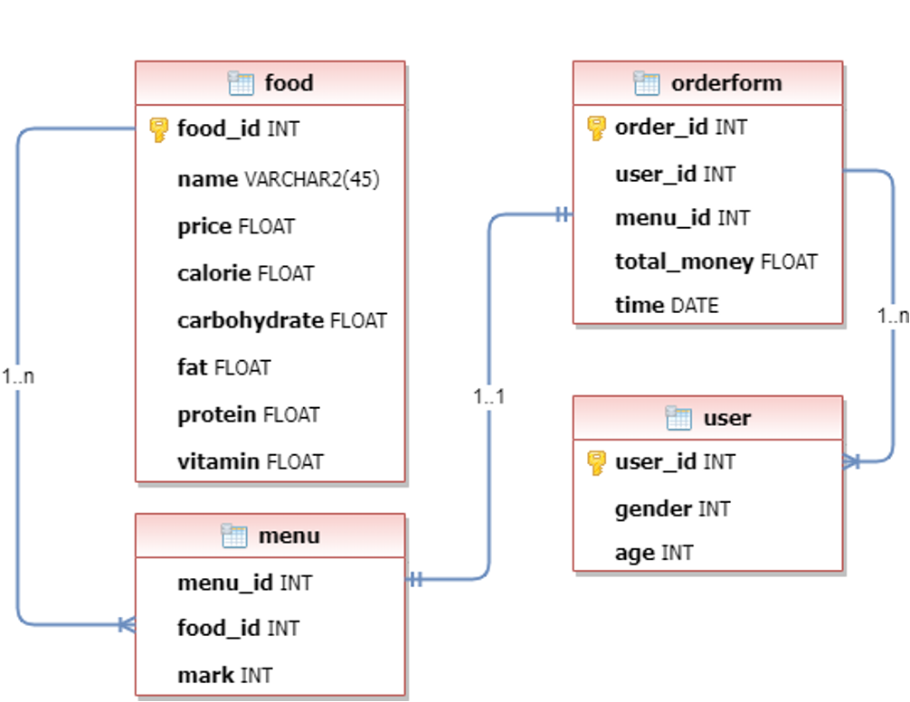

> 数据量：
>
> * food表 100条
> * menu表 106370条
> * orderform表  35496条
> * user表 500条

## 数据处理

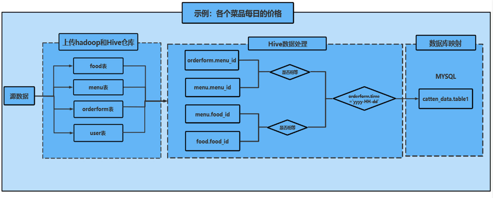

## ARIMA时间序列预测销售额


这里是将餐厅销售额的前27天作为源数据，预测餐厅最后3天的销售额，即设置预测步数为3步，最终的结果图如下所示。

灰线为用来训练的27个数据，黑线为未来值的预测，红线为95%置信区间上下限。也就是说未来真实值有95%的概率落在这个范围内。除此之外，可以看到使用ARIMA方法进行长期预测的结果是趋势性的。

由此便完成了基于ARIMA时间序列的餐厅销售额预测，预测餐厅销售额最后三天数据分别是14733、15457和16058，观察可发现所得结果与源数据相差不大，符合价格趋势。

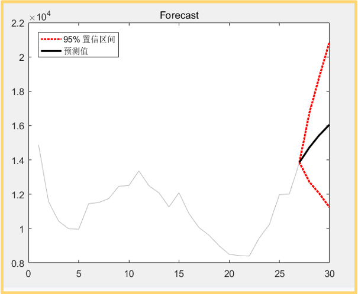

## 前端框架

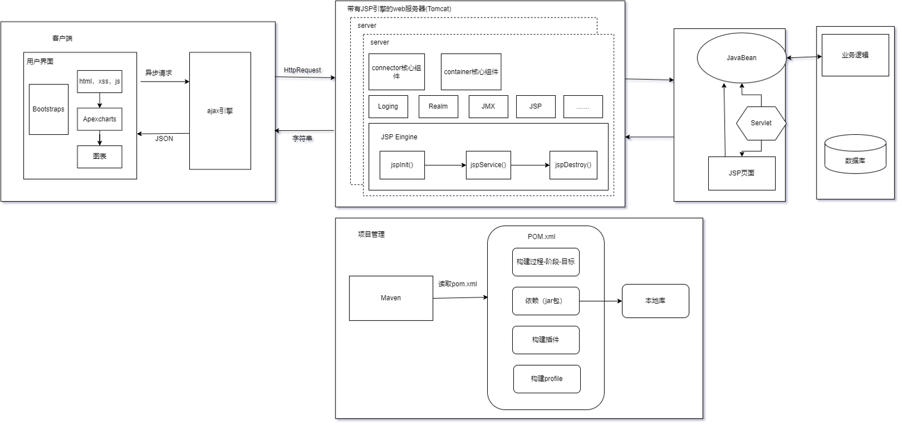

* 前端采用Bootstrap响应式布局设计，兼容不同分辨率的设备，给用户提供更好的视觉使用体验。
* 数据可视化使用ApexCharts. 相较于Echarts，ApexCharts更为轻量，图标简洁美观，可定制化程度高。但是ApexCharts文档不齐全，给开发带来了难度。
* 请求远程数据采用jQuery的AJAX实现，进入网站时异步请求所有数据，接着渲染图表，实现数据可视化。
* 基本实现前端静态网页样式以后，创建JSP动态网页，实现登陆和数据请求等业务。
* JSP中的JSON解析使用阿里的Fastjson，实现json对象与JavaBean对象的转换。
* 使用Maven管理JAVA项目，使用Git进行项目版本控制。

## 后端框架

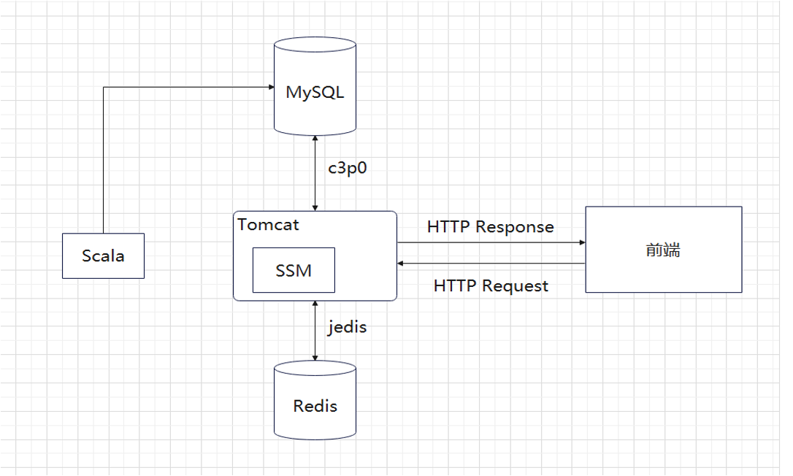

后端采用 Spring+SpringMVC+Mybatis+Redis 框架。

* 使用SSM框架实现八个模块共十七个接口
* 对部分后端处理较慢的无参接口使用AOP横切织入的方式整合Redis，对Response进行序列化存储
* 采用c3p0连接池提高复用减轻数据库压力
* 对部分后端处理较慢的无参接口使用AOP横切织入的方式整合Redis，对Response进行序列化存储
* 抛弃传统的JDBC，采用c3p0连接池减轻数据库压力
* 登录业务对密码进行前后端两次MD5加密，通过写入Cookie和Redis实现单点登录

> 版本迭代：
>
> 7.09 项目搭建以及服务器环境搭建，实现了业务1的接口：订单按照时间聚集
>
> 7.10 发现业务1的接口Bug，给出了规避方法，实现了业务5的接口：男女消费水平差异
>
> 7.11 优化业务1的接口：返回数据按时间段升序，优化业务5的接口：中文参数名改为英文，实现了业务8的接口：按日返回营业额、订单量、人流量、平均评分
>
> 7.12 对部分接口增加了参数判断，实现了业务2的接口：返回最热门、冷门、销量最高、最低的菜品列表，找了一天的打包版本bug........
>
> 7.13 实现了业务4的接口：每天三个时间段人流量
>
> 7.14 应前端要求将业务8接口进行整合，框架整合了redis，实现了管理员登录接口以及添加了相关工具类，添加跨域请求配置，实现业务11的接口：分页查询
>
> 7.15 为业务4添加更多查询数据项，整合了总交易额接口，删除了原总交易额接口，新增三餐平均营养值接口，修复了业务8接口传参为1时会炸的bug
>
> 7.16 为部分无参接口整合了redis新增，修改部分数据接口完善登录接口  
>
> 7.18 实现Cookie校验接口

## 业务需求一

### **1.1  需求设计**

智慧食堂系统登录请求业务

### **1.2  核心代码**

```java
public class AdminLoginServiceImpl implements AdminLoginService{


    @Resource
    private RedisUtil redisUtil;
    private AdminLoginMapper adminLoginMapper;

    public void setAdminLoginMapper(AdminLoginMapper adminLoginMapper) {
        this.adminLoginMapper = adminLoginMapper;
    }

    @Override
    public int login(String username, String password, HttpServletRequest request, HttpServletResponse response) {

        //根据用户名获取用户
        Admin admin = adminLoginMapper.getAdminByUsername(username);
        if(null == admin){
            //用户不存在
            return 0;
        }
        //密码校验
        if(!MD5util.formPassToDBPass(password,admin.getSalt()).equals(admin.getPassword())){
            //密码错误
            return 1;
        }
        //生成Cookie
        String ticket = UUIDUtil.uuid();
        //Session存入redis
        if(redisUtil.hasKey(username)){
            //单点登录需删除用户已有Session
            redisUtil.del((String) redisUtil.get(username));
            redisUtil.del(username);
        }
        redisUtil.set(ticket,username,2000);
        redisUtil.set(username,ticket,2000);
        //写入Cookie
        CookieUtil.setCookie(request,response,"ticket",ticket,-1);
        //登陆成功
        return 2;
    }

    @Override
    public int getUserByCookie(HttpServletRequest request, HttpServletResponse response) {
        String Cookie = CookieUtil.getCookieValue(request,"ticket");
        if(redisUtil.hasKey(Cookie)){
            //重置缓存失效时间
            redisUtil.expire(Cookie,2000);
            redisUtil.expire((String) redisUtil.get(Cookie),2000);
            //0表示已登录状态
            return 0;
        }
        //1表示未登录状态，前端需重定向登录页
        return 1;
    }
}
```

### 1.3 效果展示

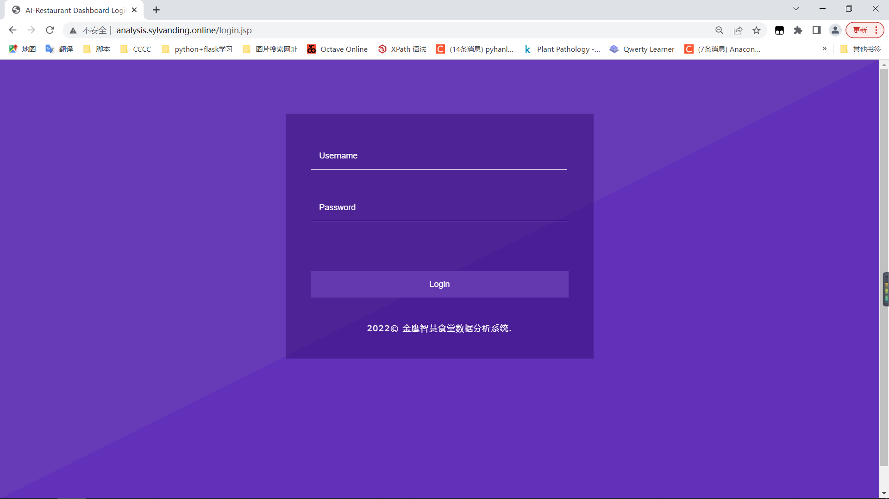

## 业务需求二

### **2.1  需求设计**

显示当天的订单总数、订单平均评分、总客流量、总营业额

### **2.2  核心代码**

```mysql
-- 当天订单的平均评分
SELECT avg(X.result1) AS RESULT
FROM(SELECT menu_id,avg(mark) AS result1 FROM menu
WHERE menu_id IN
(SELECT menu_id FROM orderform WHERE DATE(TIME)='2022-06-29')
GROUP BY menu_id) X;
 
-- 当天的总订单总数
SELECT COUNT(*) AS num
FROM orderform
WHERE DATE(TIME)='2022-06-29';
 
-- 当天的总访客数量
SELECT COUNT(DISTINCT user_id) AS num
FROM orderform
WHERE DATE(TIME)='2022-06-29';
 
-- 当天的总交易额
SELECT SUM(total_money)
FROM orderform
WHERE DATE(TIME)='2022-06-29';
```

### 2.3  效果展示

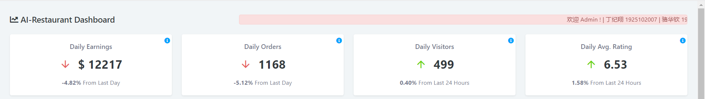

## 业务需求三

### **3.1  需求设计**

显示一个月内每日总营业额、总访客量、订单平均评分、总订单数量。对数据进行归一化，显示数据的变化趋势。

### **3.2  核心代码**

```mysql
-- 30天每日订单平均评分
SELECT DATE(TIME) AS TIME,avg(X.avg_menu) AS avg_mark
FROM orderform,
(SELECT menu_id,avg(mark) AS avg_menu
FROM menu
GROUP BY menu_id) AS X
WHERE X.menu_id=orderform.menu_id
GROUP BY DATE(TIME)
ORDER BY DATE(TIME) LIMIT 30;

-- 30天每日总交易额
SELECT DATE(TIME)AS TIME, SUM(total_money)
FROM orderform
GROUP BY DATE(TIME) ORDER BY TIME LIMIT 30;

-- 30天每日订单数量
SELECT DATE(TIME)AS TIME, COUNT(*) AS order_num
FROM orderform
GROUP BY DATE(TIME) ORDER BY TIME LIMIT 30;

-- 30天每日总访客量
SELECT DATE(TIME)AS TIME, COUNT(DISTINCT user_id) AS order_num
FROM orderform
GROUP BY DATE(TIME) ORDER BY TIME LIMIT 30;
```

### 3.3  效果展示

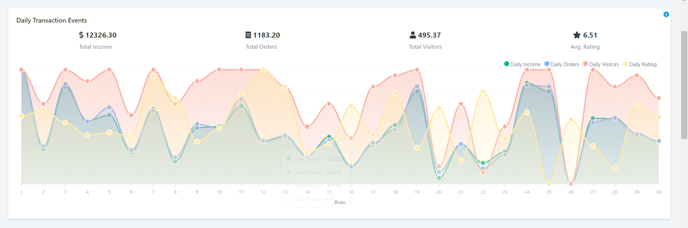

## 业务需求四

### **4.1  需求设计**

预测下一天的总营业额、总访客量、订单平均评分、总订单数量

### **4.2  核心代码**

```matlab
clear all;
clc;
filename='D:\Desktop\分布式任务\ARIMA时间序列预测结果图\transaction_data.csv';
Y=csvread(filename,1,1,[1,1,27,1]);
Y=ceil(Y);
Y=Y';
plot(Y)

%ACF和PACF图
figure
autocorr(Y)
figure
parcorr(Y)

%平滑性检验,yd1_h_adf =1，yd1_h_kpss =0，通过检验
y_h_adf = adftest(Y);
y_h_kpss = kpsstest(Y);

% 一阶差分，结果平稳。如果依旧不平稳的话，再次求差分，直至通过检验
Yd1 = diff(Y);
yd1_h_adf = adftest(Yd1);
yd1_h_kpss = kpsstest(Yd1);

%Yd2转换成列向量
Yd1=Yd1';
Y=Y';

LOGL = zeros(4,4); % Initialize
PQ = zeros(4,4);
for p = 1:4
    for q = 1:4
        Mdl = arima(p,1,q);
        [~,~,logL] = estimate(Mdl,Yd1,'Display','off');
        LOGL(p,q) = logL;
        PQ(p,q) = p + q;
     end
end

%reshape 重构数组
LOGL = reshape(LOGL,16,1);
PQ = reshape(PQ,16,1);
[~,bic] = aicbic(LOGL,PQ+1,100);
a=reshape(bic,4,4);

% 找最佳lags值 x=2，y=1，即对应ARMA（2，1）模型
a_max=max(a(:));
[x,y]=find(a==min(a(:)));


Mdl = arima(x, 1, y);  %第二个变量值为1，即一阶差分
EstMdl = estimate(Mdl,Y);
[res,~,logL] = infer(EstMdl,Y);   %res即残差

stdr = res/sqrt(EstMdl.Variance);
figure('Name','残差检验')
subplot(2,3,1)
plot(stdr)
title('Standardized Residuals')
subplot(2,3,2)
histogram(stdr,10)
title('Standardized Residuals')
subplot(2,3,3)
autocorr(stdr)
subplot(2,3,4)
parcorr(stdr)
subplot(2,3,5)
qqplot(stdr)
%上图为残差检验的结果图。
% Standardized Residuals是查看残差是否接近正态分布，理想的残差要接近正态分布；
% ACF和PACF检验残差的自相关和偏自相关，理想的结果应该在图中不存在超出蓝线的点；
% 最后一张QQ图是检验残差是否接近正太分布的，理想的结果中蓝点应该靠近红线。

% Durbin-Watson 统计是计量经济学分析中最常用的自相关度量
diffRes0 = diff(res);  
SSE0 = res'*res;
DW0 = (diffRes0'*diffRes0)/SSE0; % Durbin-Watson statistic，
% 该值接近2，则可以认为序列不存在一阶相关性。

%% 5.预测
step = 3; % 预测步数为 3
[forData,YMSE] = forecast(EstMdl,step,'Y0',Y);   
lower = forData - 1.96*sqrt(YMSE); %95置信区间下限
upper = forData + 1.96*sqrt(YMSE); %95置信区间上限

plot(forData)
disp(forData)

figure()
plot(Y,'Color',[.7,.7,.7]);
hold on
h1 = plot(length(Y):length(Y)+step,[Y(end);lower],'r:','LineWidth',2);
plot(length(Y):length(Y)+step,[Y(end);upper],'r:','LineWidth',2)
h2 = plot(length(Y):length(Y)+step,[Y(end);forData],'k','LineWidth',2);
legend([h1 h2],'95% 置信区间','预测值',...
	     'Location','NorthWest')
title('Forecast')
hold off
```

### 4.3  效果展示

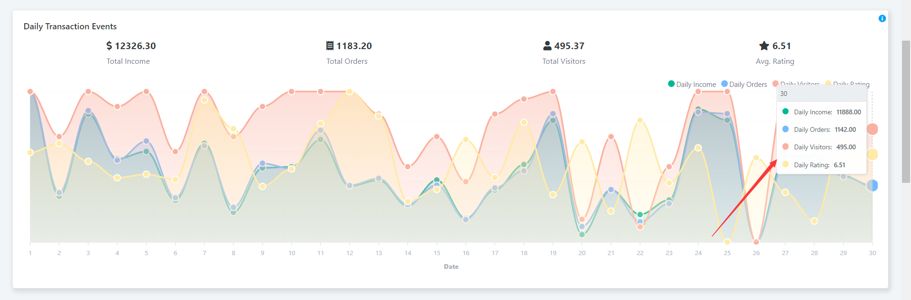

## 业务需求五

### **5.1  需求设计**

一个月内三餐的各营养平均摄入量（包括卡路里、蛋白质、脂肪、碳水化合物、维生素）

### **5.2  核心代码**

```mysql
SELECT (CASE 
WHEN HOUR(TIME) BETWEEN 6 AND 9 THEN 'morning' 
WHEN HOUR(TIME) BETWEEN 10 AND 13 THEN 'afternoon' 
WHEN HOUR(TIME) BETWEEN 16 AND 20 THEN 'evening' END) AS timeperiod,
SUM(calorie)/COUNT( DISTINCT order_id) AS avg_calorie,
SUM(carbohydrate)/COUNT( DISTINCT order_id) AS avg_arbohydrate,
SUM(fat)/COUNT( DISTINCT order_id) AS avg_fat,SUM(protein)/COUNT( DISTINCT order_id) AS avg_protein,
SUM(vitamin)/COUNT( DISTINCT order_id) AS avg_vitamin
FROM menu,orderform,food
WHERE menu.menu_id=orderform.menu_id  AND food.food_id= menu.food_id AND MONTH(TIME)='6'
```

### 5.3  效果展示

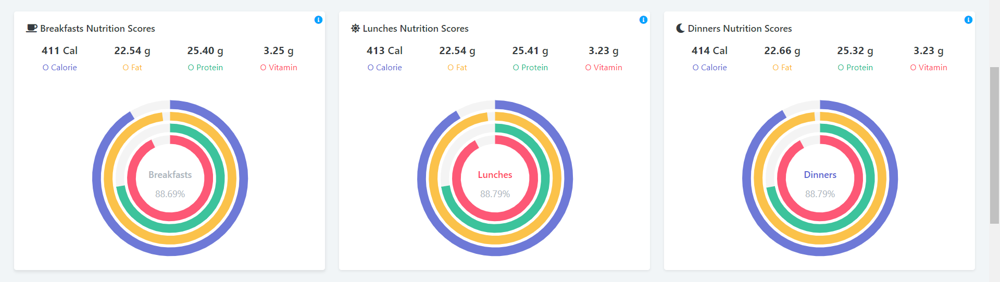

## 业务需求六

### **6.1  需求设计**

最受欢迎的10道菜、评分最差的10道菜

### **6.2  核心代码**

```mysql
--评价最差的n道菜(最不受欢迎)
SELECT food.food_id,food.name,avg(mark) AS avg_markFROM menu,foodWHERE menu.food_id=food.food_idGROUP BY food_id ORDER BY avg_mark ASC LIMIT 10;

--销量最高的10道菜(最受欢迎)
 SELECT food.food_id,food.name,COUNT(*) AS order_numFROM menu,foodWHERE menu.food_id=food.food_idGROUP BY food_id ORDER BY order_num DESC LIMIT 10;
```

### 6.3  效果展示

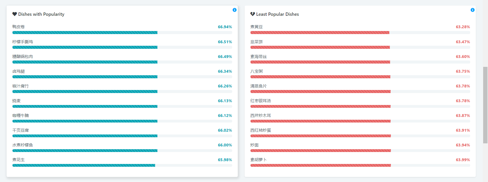

## 业务需求七

### **7.1  需求设计**

显示最近60订单数据（分页显示），可支持条件查询

### **7.2  核心代码**

**数据库查询代码**

```mysql
SELECT order_id,user_id, X.content,TIME,total_money FROM
(SELECT menu_id,group_concat(food.name) AS content
FROM menu,food
WHERE menu.food_id = food.food_id
GROUP BY menu.menu_id) AS X,orderform
WHERE X.menu_id=orderform.menu_id
ORDER BY TIME DESC LIMIT 60 ;
```

**java代码**

```java
package com.jiang.service;

import com.jiang.mapper.OrderMapper;
import com.jiang.pojo.Order;

import java.util.List;

public class OrderListServiceImpl implements OrderListService{

    private OrderMapper orderMapper;

    public void setOrderMapper(OrderMapper orderMapper) {
        this.orderMapper = orderMapper;
    }

    @Override
    public List<Order> getList() {
        return orderMapper.getOrderListByPage();
    }
}
```

### 7.3  效果展示

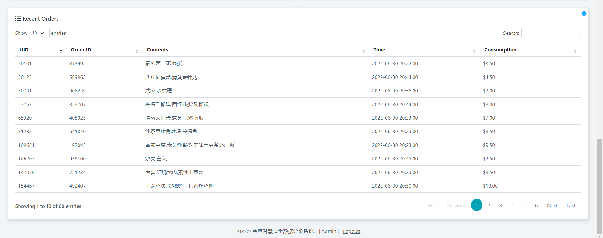

## 总体效果展示

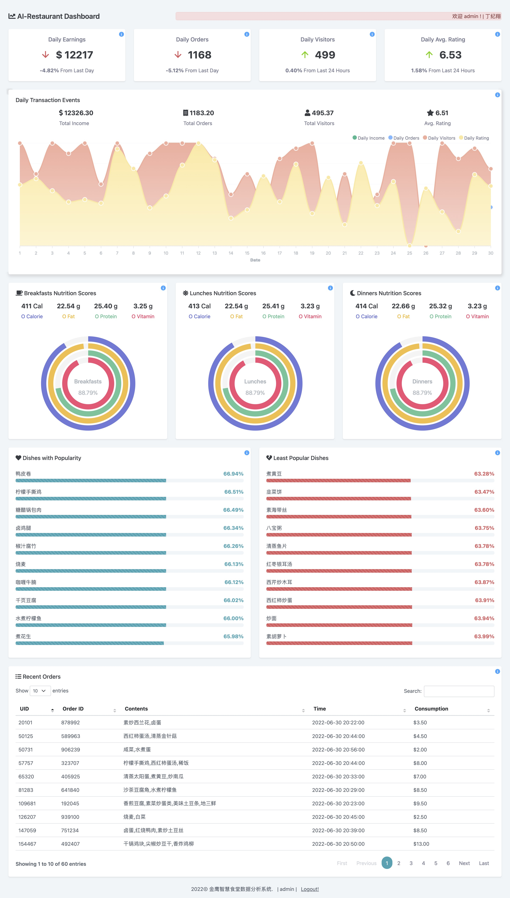

## Conclusion

### 符合预期的项目结果

* 实现了菜品评分、健康饮食、订单管理、后台管理等一系列功能。
* 实现了登录功能。
* 完成了对营业额进行预测的ARIMA时间序列预测销售额算法。

### 项目需要改进的地方

* 实现多个食堂的数据分析。
* 实现三餐食物营养达标比例 。
* 在网页端实时实现数据的增删改查。

## Contributor

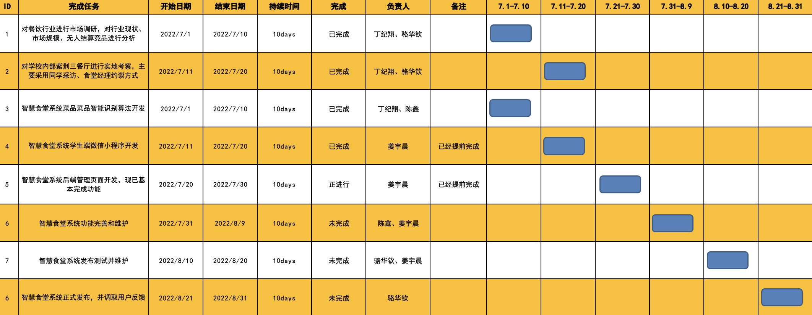
